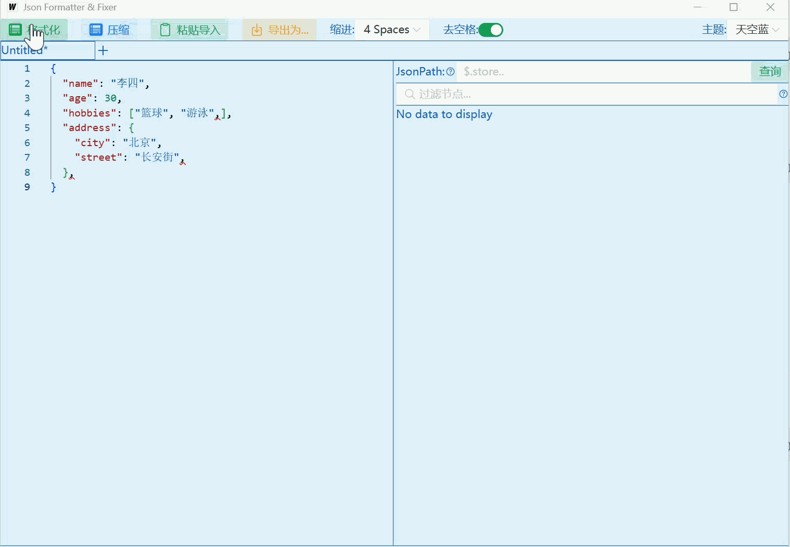
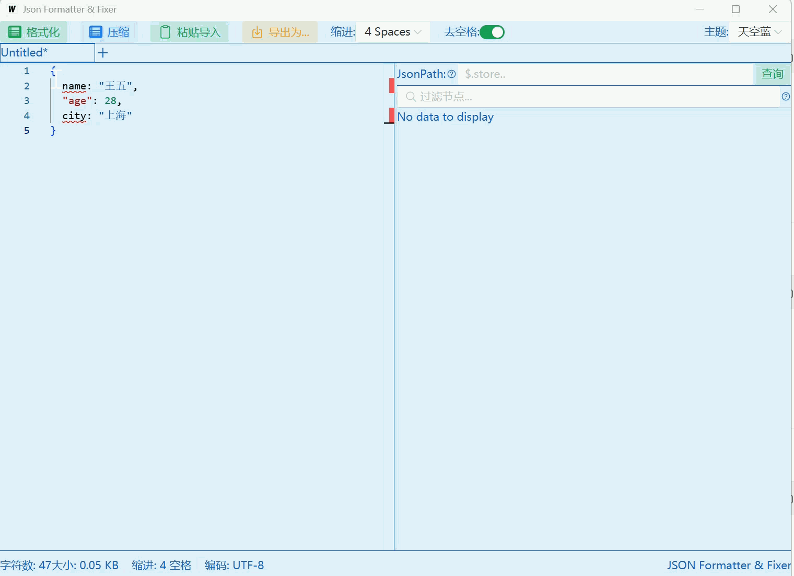
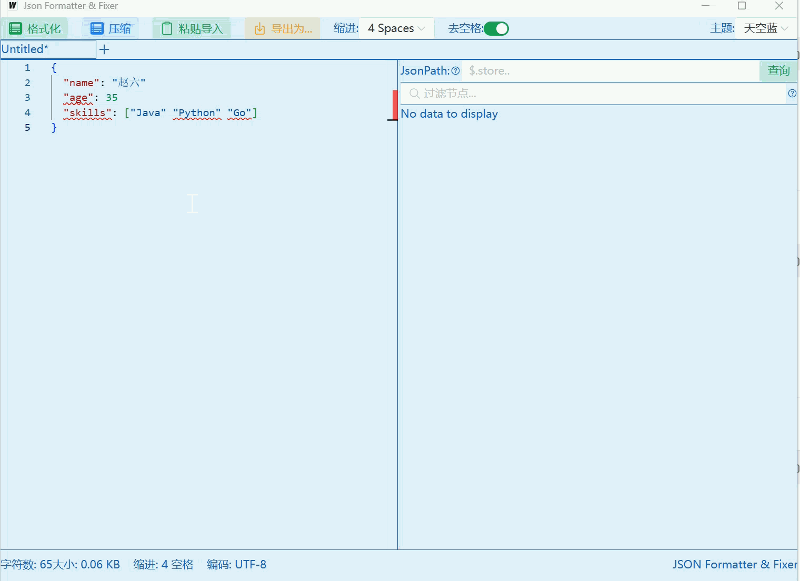
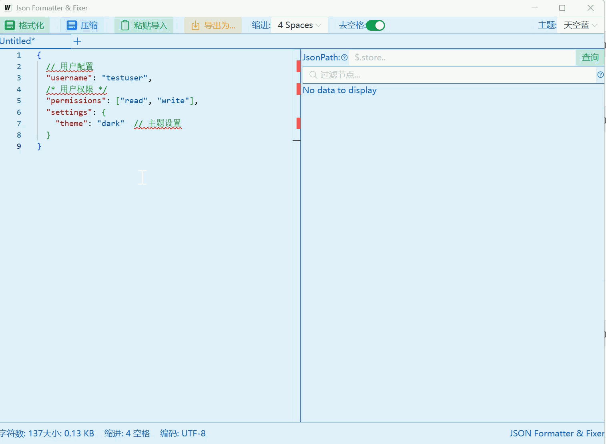
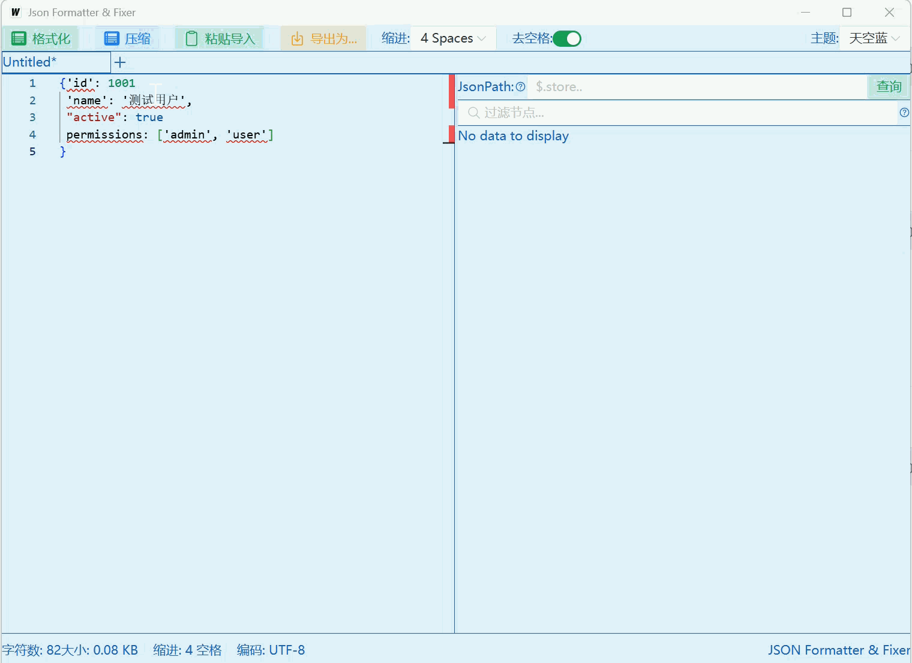
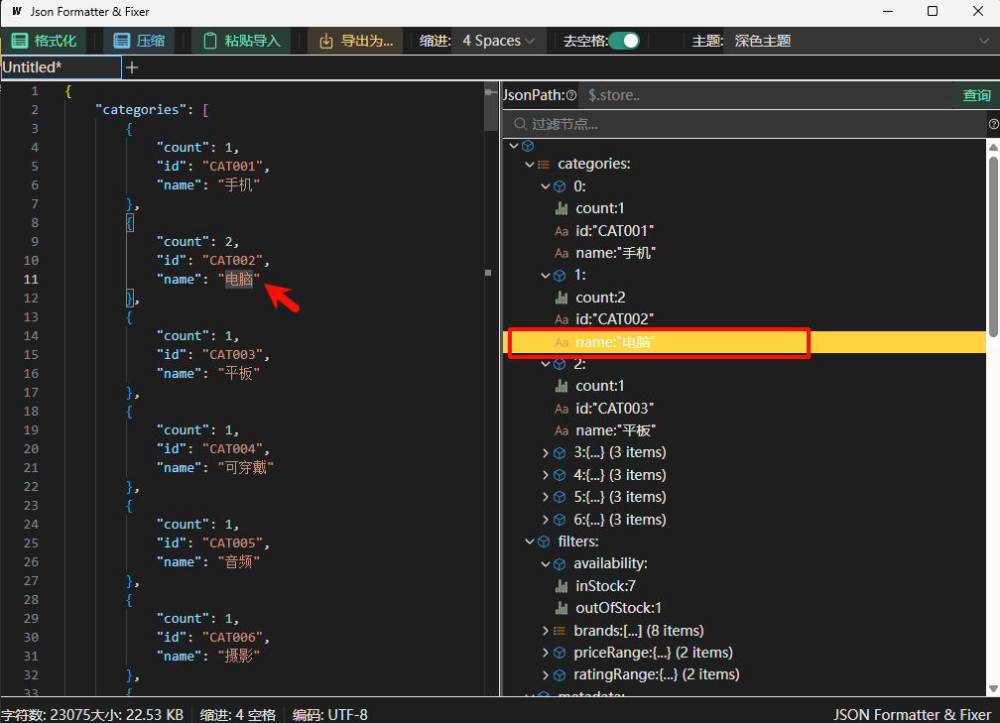
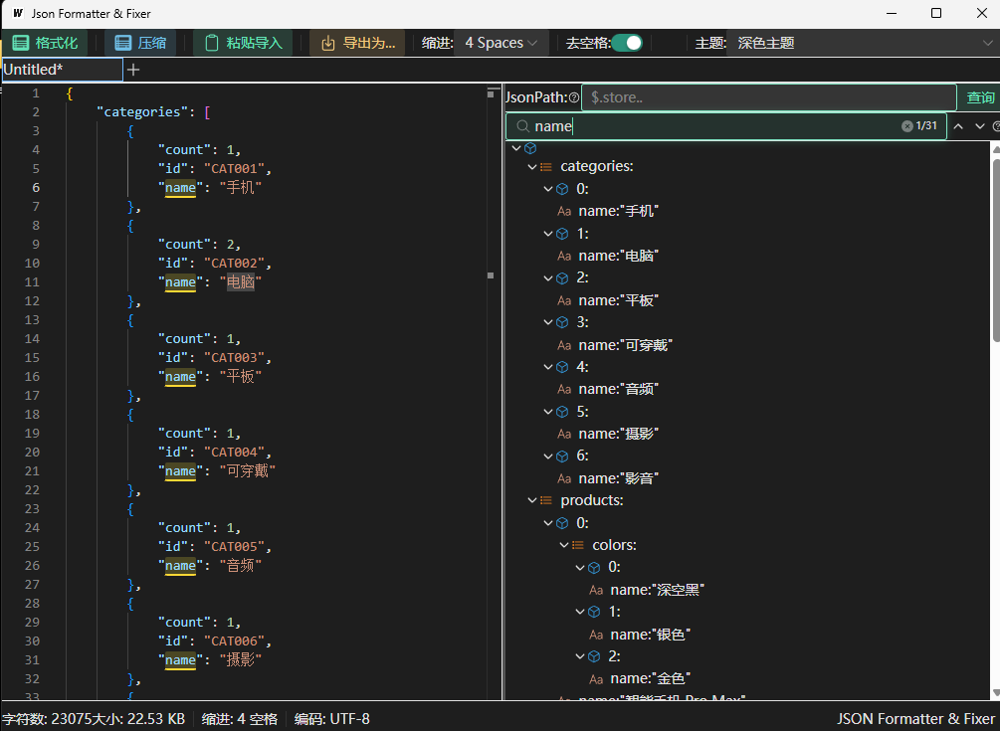
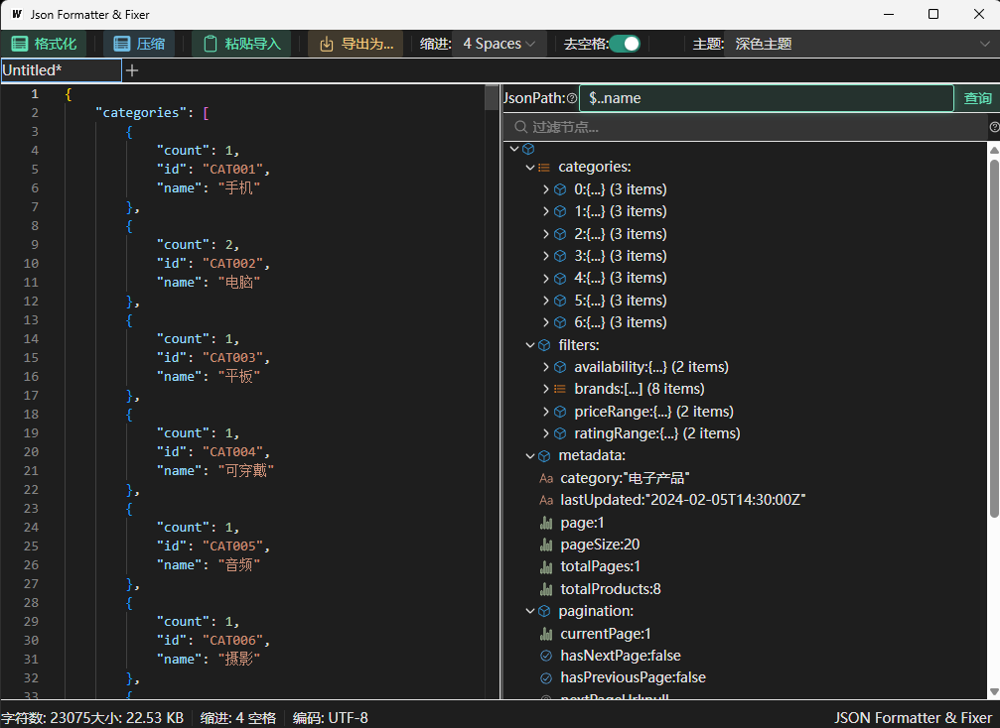
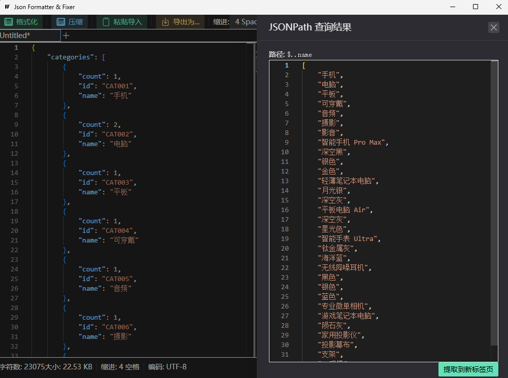

# JSON Formatter & Fixer

一个功能强大的 JSON 格式化与智能修复工具，旨在对JSON内容进行格式化,并解决日常开发中经常遇到的非标准、残缺或格式错误的 JSON 数据处理问题。

## 🌟 核心亮点：智能修复功能

本工具不仅仅是一个JSON格式化工具，更是一个强大的 **JSON 修复专家**。它能够自动识别并修复多种常见的 JSON 格式错误：

### 修复效果展示
















## 🔍 进阶查询与定位功能

除了核心的修复功能，本工具还提供了强大的数据查询与定位能力，帮助你从海量 JSON 数据中快速提取关键信息：

### 1. 智能定位 (Focus)
鼠标点击JSON内容 ,可以快速定位到对应节点，高亮显示相关内容，让结构一目了然。


### 2. 数据过滤 (Filter)
支持通过简单的关键字过滤 JSON 数据，实时筛选出符合条件的内容。点击右侧的向上向下箭头,可快速继续定位.


### 3. JSONPath 支持
内置完整的 JSONPath 查询引擎，支持复杂的表达式筛选，轻松应对深层嵌套数据的提取需求。



#### JSONPath 常用语法说明：
- **`$`** : 根节点。
- **`.` 或 `[]`** : 子节点操作符。
- **`..`** : 深层扫描，查找所有符合条件的节点。
- **`*`** : 通配符，匹配所有成员。
- **`[start:end:step]`** : 数组切片。
- **`?()`** : 过滤表达式（如 `$.store.book[?(@.price < 10)]`）。

#### 快速示例：
- 提取所有姓名：`$..name`
- 获取列表第一个元素：`$.items[0]`
- 筛选价格大于 50 的商品：`$..products[?(@.price > 50)]`


## 🚀 主要功能

1.  **一键格式化**：将混乱的 JSON 字符串转换为美观、易读的层级结构。
2.  **深度修复**：对非法 JSON 进行深度扫描并尝试恢复其原始语义。
3.  **多平台支持**：支持 Windows、macOS 和 Linux。
4.  **简洁 UI**：基于 Wails 框架构建，提供原生应用级别的流畅体验。

## 🛠️ 安装与构建

项目使用 [Wails](https://wails.io/) 框架开发。

### 前提条件
- Go 1.20+
- Node.js & npm
- Wails CLI

### 快速构建
你可以使用项目根目录下的 `Makefile` 进行跨平台构建：

```bash
# 构建 Windows 版本
make windows

# 构建 macOS 版本
make darwin

# 构建 Linux 版本
make linux

# 一键构建所有平台
make all
```

### Linux 依赖安装 (Ubuntu/Debian)

在 Linux (如 Ubuntu 24.04) 上运行或构建应用前，需要安装必要的系统库：

```bash
# 安装运行和构建依赖
sudo apt update
sudo apt install -y libgtk-3-dev libwebkit2gtk-4.1-dev pkg-config build-essential
```

> **注意**：Ubuntu 24.04 不再支持 `libwebkit2gtk-4.0`。我们在构建时已默认添加了 `-tags webkit2_41` 标签以适配最新系统。如果您在旧版本 Linux 上构建，可能需要去掉该标签。

## 📖 使用方法

1.  打开应用。
2.  将需要处理的 JSON 文本粘贴到输入框中,或者点击 **"粘贴导入"**按钮 。
3.  点击 **"格式化"** 按钮。
4.  JSON格式如果不正确 ,将自动修复,并显示格式化后的 JSON 结果。

---


